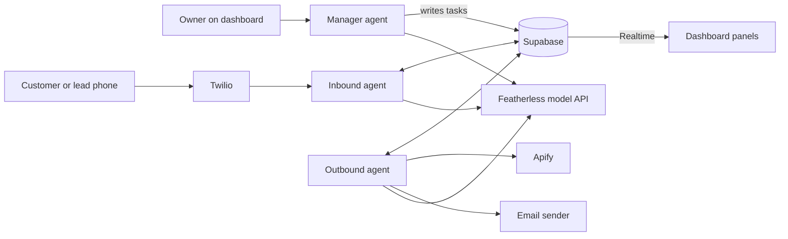
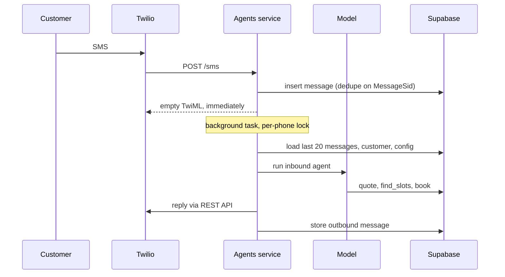
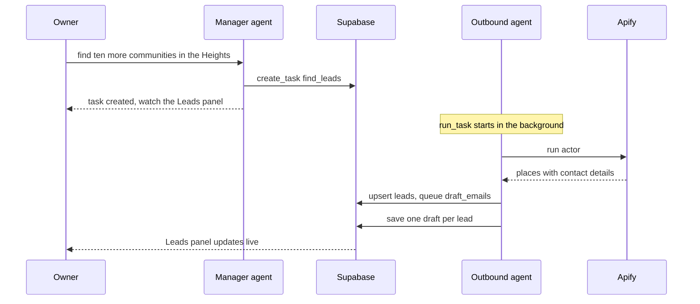

# Architecture: Royal Pawz AI employee (hackathon demo)

For the team. Read this once before you open your lane. The exact interfaces live in `docs/CONTRACTS.md`; this file explains why they look the way they do.

## 1. Summary

We are building one "AI employee" for one business, Royal Pawz, made of three agents that share one Supabase database:

- The **inbound agent** answers texts on the business number, quotes, offers slots and books.
- The **outbound agent** finds partner leads with Apify, drafts a personal email for each, and sends when a person clicks Send.
- The **manager agent** is a chat box on the dashboard. The owner asks it what happened and tells it what to do next. It hands work to the other two.

The agents never call each other. They coordinate through the database. That is the multi-agent story, and it is also what keeps the build simple: each lane can work alone as long as it respects the tables.

The business itself is one config row. Swap the row and the same three agents work for a detailer or a meal-prep company. That sentence is the entire SaaS pitch tonight. Around it sits a landing page, email/password login and a demo onboarding that never writes, but there are still no tenants: one workspace, one config row.

**Payments are out of scope.** A booking is confirmed the moment the inbound agent books it. There is no pay link, no Stripe and no webhook.

## 2. The demo in four beats

1. **Outbound.** Twenty Houston apartment communities sit in the Leads panel. Open one. The email names the property and offers residents a monthly grooming day. Click Send and it lands in a judge's inbox.
2. **Inbound.** The judge texts the number in that email and mentions the property. The agent recognizes the lead, flags it to the owner as a hot partner lead, then answers a grooming question, quotes by size and coat, offers slots and books. The booking appears in the Bookings panel.
3. **Manager.** Ask it "what happened in the last ten minutes?" It reports the email, the conversation and the booking with real numbers. Then tell it "find ten more communities in the Heights and draft emails." A task appears, the outbound agent runs, and new leads and drafts fill in.
4. **The close.** Show the trace panel with all three agents in it, then the config row. "Swap this row and it is a different business. Royal Pawz goes live Monday."

## 3. System diagram



The dashboard reads Supabase directly and never writes to it. Every write goes through the agents service.

## 4. The three agents

Each agent is the same loop with a different prompt and a different list of tools. The model decides what to call and what to say. Code computes everything that has to be right: prices, slots, who gets an email.

### Inbound

| Tool | What it does |
| --- | --- |
| get_info | Hours, service area, services and policies from the config row |
| quote | Line items and a total, computed in code from the config |
| find_slots | Up to three open slots in a date range |
| book | Recomputes the price, takes the slot atomically, creates a confirmed booking |
| lookup_lead | Matches a property name against leads and marks the lead as replied |
| escalate | Texts the owner a summary: refunds, complaints, medical or aggressive-pet issues, off-menu asks, hot partner leads |

It says it is Royal Pawz's AI assistant in its first reply, keeps replies under 320 characters, answers in the customer's language, and never states a price or a time that did not come from a tool.

### Outbound

Finding leads and sending email are plain code. Only drafting uses the model.

| Step | Trigger | What runs |
| --- | --- | --- |
| Find | A `find_leads` task | One Apify actor (Google Maps with contact details) runs for a search term and area. Results are upserted into `leads`. A `draft_emails` task is queued for the new rows. |
| Draft | A `draft_emails` task | One short agent run per lead, one after another. The agent reads the lead and saves a subject and body. |
| Send | A person clicks Send | The service checks the allowlist, sends the saved draft, and marks the lead sent. |

**The model never sends email.** Only a click does.

### Manager

| Tool | What it does |
| --- | --- |
| get_summary | Counts and notable events since N minutes ago |
| list_leads, list_bookings | Rows, filtered by status |
| get_conversation | The last 20 messages with a customer |
| create_task | Hands work to the inbound or outbound agent |

It has narrow tools and no free-form SQL. Narrow tools are more reliable on an open model, and the manager cannot leak or delete data. It ships read-only first; `create_task` is added last. If we run out of time, a read-only manager still demos.

## 5. Shared state: how the agents share information

This is the part to understand before you write code. The database is the agents' shared memory and their only communication channel.

There are four kinds of shared information:

| Kind | Table | Example |
| --- | --- | --- |
| What the business is | `business_config` | Services, prices, hours, tone, the outbound offer. Every agent reads it. Nobody writes it at runtime. |
| What we know about people | `customers`, `leads`, `shared_notes` | The inbound agent notes that Bella is nervous around dryers. Later the manager can answer "anything I should know about Bella?" |
| Work to hand off | `tasks` | The manager writes "find ten more communities in the Heights." The outbound agent picks it up. |
| What happened | `messages`, `bookings`, `agent_events` | The manager's summary and the dashboard's trace panel both read these. |

`shared_notes` is the explicit shared memory. Every agent has two extra tools, `remember(about, note)` and `recall(about)`. Keys look like `customer:+17135550100`, `lead:<uuid>` or `business`.

Who may read and write each table:

| Table | Inbound | Outbound | Manager | Dashboard |
| --- | --- | --- | --- | --- |
| business_config | read | read | read | read |
| customers | read, write | none | read | read |
| messages | read, write | none | read | read |
| slots | read, take | none | read | read |
| bookings | read, write | none | read | read |
| leads | read, mark replied | read, write | read | read |
| tasks | read own, update status | read own, update status | write | read |
| shared_notes | read, write | read, write | read, write | read |
| agent_events | write | write | write | read |

Row-level security is on for every table with select-only policies: the browser can select, signed out (`anon`) or signed in to the dashboard (`authenticated`, from `0003_auth_read`), and nothing else. The agents service uses the service role key. Nobody can scribble on the demo from a browser console. Use demo data only, because judges' phone numbers will be in `messages`.

## 6. Two flows worth seeing

### A text becomes a booking



Twilio waits about 15 seconds for a webhook. A turn with several tool calls can take longer than that on an open model, so `/sms` answers at once and the reply goes out through the REST API when the run finishes.

### The manager hands work to the outbound agent



## 7. Repo layout and ownership

One repo, two runtimes. Python cannot live in Next's `/lib`, so the agents get a top-level `/agents` folder and `/lib` stays TypeScript.

```text
app/  components/  lib/      Next.js landing page, login, onboarding and dashboard (lane 1 shell; ManagerChat.tsx is lane 4)
proxy.ts                     login guard for /dashboard and /onboarding (lane 1 shell)
agents/
  runtime/                   the shared loop, model client, tool registry, events (lane 1)
  inbound/                   prompt, tools, Twilio I/O (lane 1)
  outbound/                  prompt, tools, Apify and email I/O (lane 3)
  manager/                   prompt, tools (lane 4)
  booking.py  db.py          quote, slots, bookings, DB client (lane 2)
  tasks.py                   routes a task row to its agent (lane 3)
  main.py                    FastAPI routes
supabase/                    migrations 0001 to 0003 and seed (lane 2)
docs/CONTRACTS.md            frozen interfaces
CLAUDE.md                    rules every Claude Code session loads
```

Each lane folder has its own `CLAUDE.md`. Claude Code loads the root file in every session and loads a nested one when it reads files in that folder, so your session gets your lane's context without carrying everyone else's.

| Lane | Owns | First job after the bootstrap |
| --- | --- | --- |
| 1. Inbound and dashboard shell | `agents/runtime`, `agents/inbound`, `app/`, `components/` (except `ManagerChat.tsx`), `lib/`, `proxy.ts` | Real system prompt, wire the six tools, smoke test against the real model; landing page, login and dashboard pages |
| 2. Data | `supabase/`, `agents/db.py`, `agents/booking.py`, deploys | Apply the migration and seed, real `quote()`, atomic slot taking, then deploy both services |
| 3. Outbound | `agents/outbound`, `agents/tasks.py` | Check the Apify actor's input schema, real `find_leads`, then drafting |
| 4. Manager | `agents/manager`, `components/ManagerChat.tsx` | Read-only manager tools, then `create_task` |

Dropping payments shrank lane 2, so lane 2 also owns deployment and is the first person to help whoever is behind.

## 8. The runtime

All three agents run on one loop of about 100 lines on the OpenAI Python client, pointed at Featherless. There is no agent framework. On an open model on demo day, a framework is one more thing to debug.

Rules that live in the runtime so no agent has to remember them:

- The provider, key and model come from env. Tonight that is Featherless and `Qwen/Qwen3-32B`, which Featherless lists for native tool calling. If tool calls are flaky, changing three env vars moves us to another provider.
- One process-wide semaphore caps model calls at two in flight. Featherless prices concurrency, not tokens: a 32B model costs 2 units per call, so a 4-unit plan allows two at once and rejects the rest with HTTP 429. Check your plan with `GET /v1/plan`.
- Calls retry three times with jitter on 429 or timeout.
- Thinking is switched off for Qwen3, and any think block is stripped before text leaves the service. Reasoning must never reach a customer.
- Tool arguments are validated with pydantic. A bad call returns the error to the model once.
- Every tool call and every reply becomes a row in `agent_events`. That table is the trace panel and our debugging log.
- A lock per phone number stops two quick texts from starting overlapping runs.
- `LLM_FAKE=true` returns a canned reply, so the whole system runs with no model key while you build.

Because the outbound agent drafts one lead at a time and inbound texts go first, three agents fit inside two concurrent calls.

## 9. Where it runs

| Piece | Dev | Demo |
| --- | --- | --- |
| Dashboard (Next.js) | localhost:3000 | Vercel |
| Agents service (FastAPI) | localhost:8000 behind ngrok | One always-on host such as Railway or Render. A laptop behind ngrok is the tested fallback. |
| Twilio webhook | the ngrok URL + `/sms` | the agents host URL + `/sms` |

The agents service is not on Vercel. It answers Twilio immediately and keeps working in the background, and an Apify run can take minutes. A serverless function can be frozen as soon as it responds, so background work there runs sometimes and vanishes other times. One always-on process avoids the whole class of problem.

The browser only calls `/agents/*` on its own origin. Next.js rewrites that to `AGENTS_URL`, so there is no CORS setup and moving from dev to demo is one env var.

## 10. Scope

| In | Out |
| --- | --- |
| Inbound SMS agent: info, quote, slots, confirmed booking, lead recognition | Payments of any kind |
| Outbound agent: Apify leads, personal drafts, click to send | Tenants, real onboarding, social or magic-link login |
| Manager agent: reports and task hand-offs | Free-form SQL, scheduled jobs, queues |
| Shared notes across agents | Voice, calendar sync |
| Landing page, email/password login, a demo onboarding that never writes | Any integration with the Royal Pawz production system |
| Dashboard pages on Realtime: overview, inbox, leads, bookings, activity, manager, settings | Login in front of the agents service's `/agents/*` routes |

## 11. Plan

Start the clock (T0) when the bootstrap commit lands on `main`.

| When | Must be true |
| --- | --- |
| T0 + 15 min | Everyone has pulled, set env vars, read `docs/CONTRACTS.md`, and run the smoke test with `LLM_FAKE=true` |
| T0 + 75 min | Each lane's first real path works alone: a real text gets a real quote; the migration and seed are applied; an Apify run lands leads; the manager answers from real data |
| T0 + 2 h | Integration: text to confirmed booking, a draft for every lead, Send reaches an allowlisted inbox, the manager hands one task to outbound |
| 5:45 PM | Feature freeze. Fixes only. Both services deployed. |
| 6:15 PM | Backup video recorded. Two rehearsals on real phones. |
| 6:30 PM | Submitted. The deadline is 7:00; keep the buffer. |

Cut order if behind: the manager's `create_task` (keep it read-only), then `shared_notes`, then `lookup_lead`, then the live Apify run (show cached leads and say so).

Never cut: a text that ends in a confirmed booking, a Leads panel with personal drafts, one email landing in a judge's inbox.

## 12. Outreach rules for tonight

- Email only. No cold texts. Carriers block them and the law is stricter.
- The send route only delivers to `SEND_ALLOWLIST`: the team and the judges. Real leads get drafts, not emails, until Monday.
- Send from a domain that is already verified. Do not set up a new sending domain today.
- Every draft carries the business name, a mailing address and an opt-out line.
- An Apify run takes a minute or more. Run it before the demo. If you also trigger a live run on stage, say which leads are cached.

## 13. Open questions

| Question | Default if nobody answers |
| --- | --- |
| Real Royal Pawz services, prices, zips, policies? | Real values from the SMS export are in `seed.sql`; the assumptions still to confirm are listed in the config's `_notes` |
| Who does outbound target? | Pet-friendly apartment communities in Houston. Vets and daycares are a search-term swap. |
| Which verified sender and email provider? | Whatever the team already sends from; `EMAIL_PROVIDER` picks the client |
| Which addresses go on the allowlist? | The team's, plus judges added at the table |
| Which always-on host for the agents service? | Railway or Render, lane 2's call; laptop plus ngrok as fallback |
| Does someone have a fallback model key in env? | Yes, unused unless Featherless tool calls are flaky |
